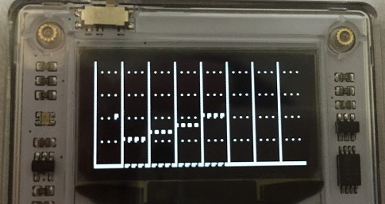

# nanoseq
nanoseq is nano size sequencer for Arduboy ( https://www.arduboy.com/ )

## screen

- Vertical lines means each 8 beats.
- Horizontal lines means each 1 octaves.

## how to use
- Move cursor
  - allow keys
- Set tone at cursor position
  - A button
- Play music
  - Move cursor at the most left side and press left button.
- Semitone
  - Press A button and Up or Down key.

## Changelog
- 2016/09/22
  - support semitone

